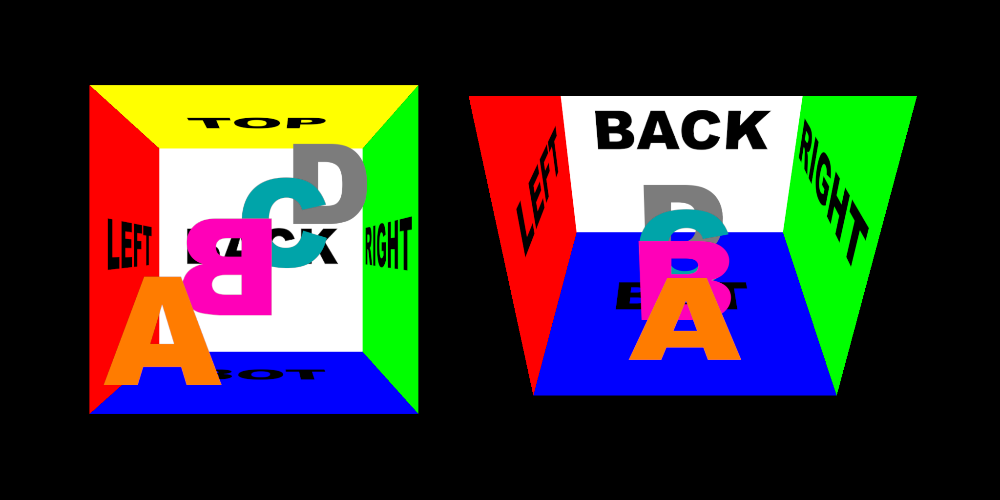

# osl-nodes
The OSL code I make is only tested with Isotropix Clarisse. It is thus designed for Y up axis coordinates in mind.

## Interior Mapping Shader

| interior_mapping.osl |
|-|
| Room mapping with custom depth and horizontal/vertical scale |
| 4 modular layers, with custom depth and hozizontal/vertical offset |
| Global texture flop for the room, individual texture flop for each layers |
| Testing texture template included |

Interior mapping was invented by Joost van Dongen.
Thanks to Julius Ihle since I saved quite some time by studying his work.

## Grading

| grade_color.osl |
|-|
| Designed to match Nuke's Grade node |
| + some extras that are needed for advanced lookdev |
| Pre & Post remap options to avoid extra nodes use |
| Inspired by Image Engine tools that were my all time favorites |

| grade_color.osl |
|-|
| Base on grade_color.osl for float only |
| Pre & Post remap options to avoid extra nodes use |

### Feedback
Code is never clean enough, settings are never self-exaplanatory enough.
If you have ideas, feel free to contact me or to submit a commit ;)
